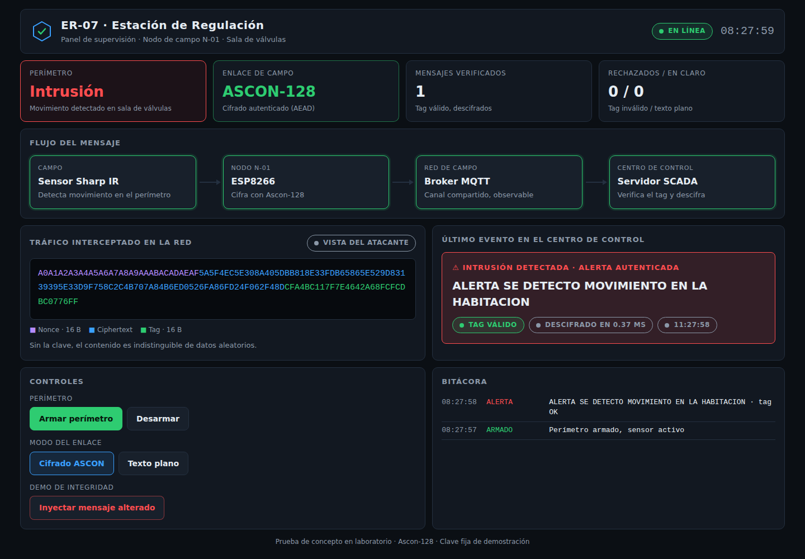
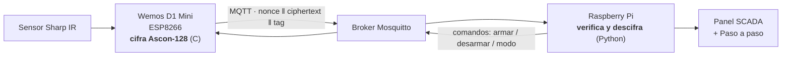
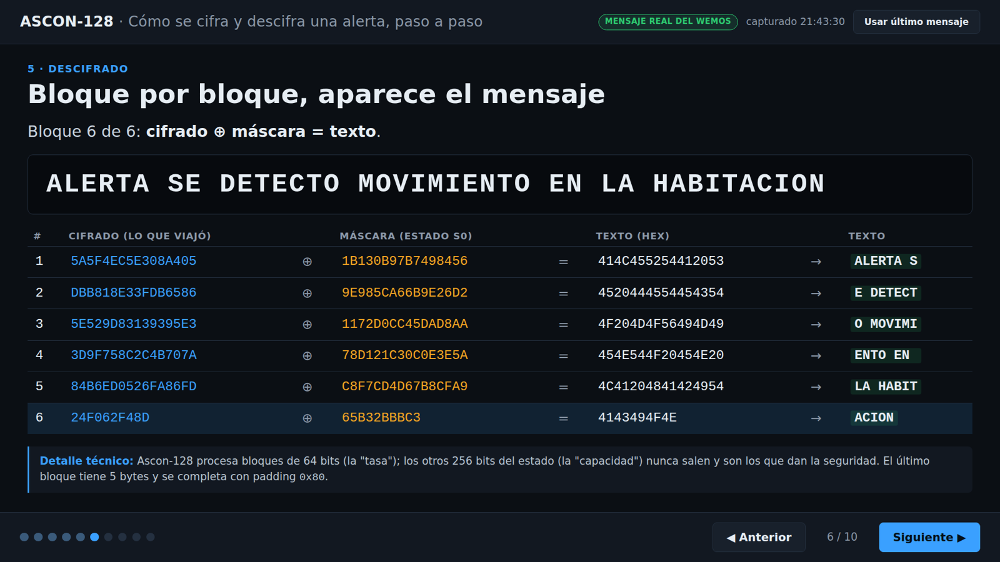
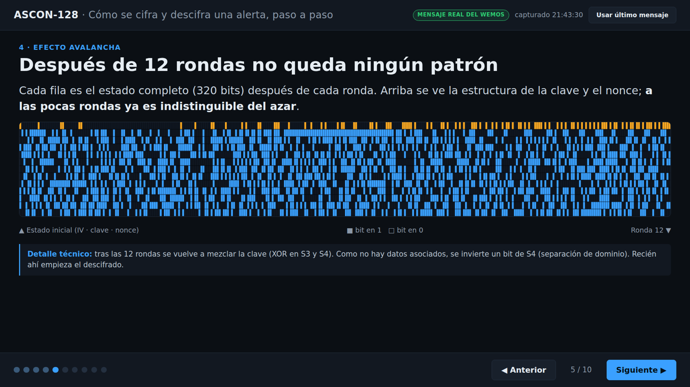
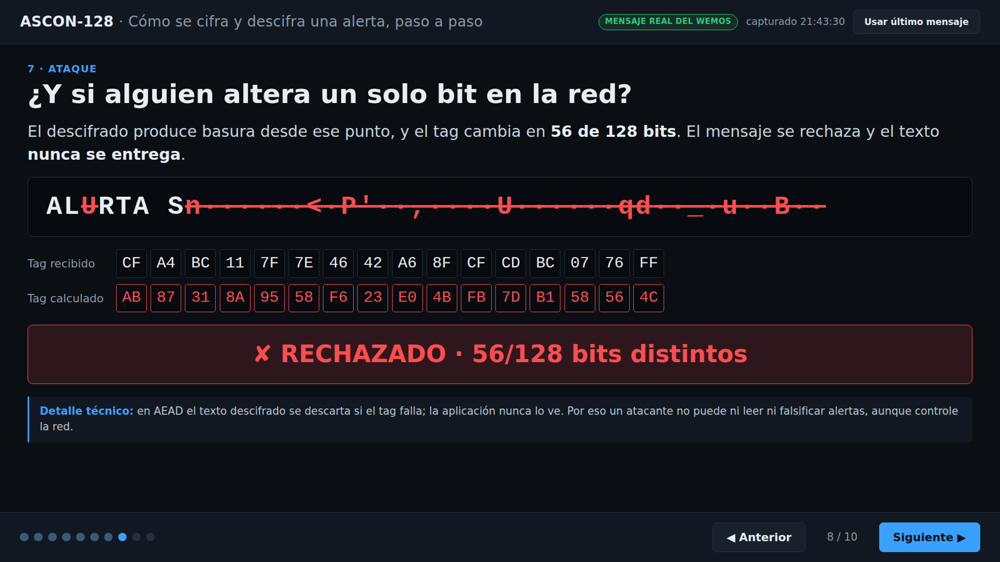

# Criptografía ligera en IoT: ASCON-128 en ESP8266 🌐🔒

Prueba de concepto que implementa el algoritmo de cifrado autenticado **Ascon-128** en un microcontrolador **Wemos D1 Mini (ESP8266)**. El nodo cifra las alertas de un sensor y una **Raspberry Pi** las **verifica y descifra en Python**, antes de mostrarlas en un panel de supervisión estilo SCADA.

El escenario simula el nodo de campo de una infraestructura crítica: un sensor vigila el perímetro de una sala de válvulas y, al detectar una intrusión, envía una alerta cifrada al centro de control.

> Presentado en **Ekoparty**. Basado en el Trabajo Final Integrador de la Especialización en Criptografía y Seguridad Teleinformática.



---

## ¿Qué cambió respecto de la versión anterior?

| Antes | Ahora |
|---|---|
| El Wemos cifraba y **se descifraba a sí mismo** | El Wemos **solo cifra**; la Raspberry Pi **verifica y descifra en Python** |
| El texto plano también viajaba por la red | Solo viaja `nonce ‖ ciphertext ‖ tag` |
| El nonce no se transmitía | El nonce viaja con cada mensaje (es público, no secreto) |
| Nonce generado con `random()` | Nonce del generador aleatorio por hardware del ESP8266 (`RANDOM_REG32`) |
| Panel web básico | Panel SCADA en tiempo real + página **paso a paso** del descifrado |
| Dependía de WiFi externa | Red propia: la Raspberry Pi funciona como punto de acceso |

---

## Arquitectura



**Formato del mensaje** (tópico `tu/tema/encryptado`, en hexadecimal):

```
| nonce (16 bytes) | ciphertext (45 bytes) | tag (16 bytes) |
```

- **Nonce:** número único por mensaje. No es secreto, pero no debe repetirse con la misma clave.
- **Ciphertext:** mismo largo que el mensaje original.
- **Tag:** sello de autenticidad. Si se altera un solo bit, el tag no coincide y el mensaje se rechaza.

### Compatibilidad entre C y Python

Ambos lados implementan **Ascon-128 v1.2**, la versión ganadora del concurso NIST de criptografía ligera:

- **ESP8266:** [ascon-suite](https://github.com/rweather/ascon-suite), rama **`final-round`**.
- **Raspberry Pi:** [pyascon](https://github.com/meichlseder/pyascon), la implementación de referencia de los autores de ASCON, en el commit `c77cc98` (última versión v1.2).

> ⚠️ El estándar final **NIST SP 800-232 (Ascon-AEAD128)** no es compatible byte a byte con v1.2. No mezclar versiones: si un lado usa SP 800-232 y el otro v1.2, todos los mensajes serán rechazados por tag inválido.

La página "paso a paso" incluye una verificación cruzada: Python vuelve a cifrar el mensaje con el mismo nonce y obtiene exactamente el mismo resultado que el ESP8266.

---

## Hardware

| Componente | Función |
|---|---|
| Wemos D1 Mini (ESP8266) | Nodo de campo: lee el sensor y cifra |
| Sensor Sharp IR GP2Y0A41SK0F (4–30 cm) | Detección de presencia |
| Aro NeoPixel de 24 LEDs | Estado: verde = armado, rojo = intrusión |
| Raspberry Pi 5 | Broker MQTT, servidor web y descifrado |
| Adaptador WiFi USB Atheros AR9271 | Punto de acceso de la red de la demo |
| Pantalla HDMI táctil de 5" (opcional) | Consola local |


### Conexiones del nodo

| Componente | Cable | Pin Wemos |
|---|---|---|
| Sharp IR | VCC (rojo) | 5V |
| Sharp IR | GND (negro) | G |
| Sharp IR | Señal (amarillo) | A0 |
| NeoPixel | 5V | 5V |
| NeoPixel | GND | G |
| NeoPixel | DIN | D5 |

---

## Instalación

### 1. Nodo de campo (Wemos D1 Mini)

1. Arduino IDE + driver **CH340**.
2. En *Preferencias → URLs adicionales del gestor de placas*:
   `https://arduino.esp8266.com/stable/package_esp8266com_index.json`
3. Instalar la placa **esp8266 by ESP8266 Community** y seleccionar **LOLIN(WEMOS) D1 R2 & mini**.
4. Instalar las librerías: **Adafruit NeoPixel**, **PubSubClient** (≥ 2.8) y **SharpIR** (Giuseppe Masino).
5. Instalar **ascon-suite** desde la rama `final-round`: descargar
   `https://github.com/rweather/ascon-suite/archive/refs/heads/final-round.zip`
   y agregarla con *Programa → Incluir biblioteca → Añadir biblioteca .ZIP*.
6. En `wemos/ekoparty/ekoparty.ino`, completar `ssid` y `password` con los datos de la red, y compilar.

> **Error `control reaches end of non-void function` en SharpIR.cpp:** las versiones nuevas del soporte ESP8266 lo tratan como error. Se soluciona agregando `return 0;` antes de la última llave de `SharpIR::getDistance()` en `libraries/SharpIR/src/SharpIR.cpp`.

### 2. Raspberry Pi (Raspberry Pi OS con escritorio)

**Dependencias**
```bash
sudo apt install -y mosquitto mosquitto-clients python3-flask python3-flask-socketio python3-paho-mqtt
```

**Broker MQTT accesible desde la red** (Mosquitto 2.x solo escucha en localhost por defecto)
```bash
echo -e "listener 1883\nallow_anonymous true" | sudo tee /etc/mosquitto/conf.d/demo.conf
sudo systemctl restart mosquitto
```

**Punto de acceso con el adaptador USB** (`wlan1`, IP fija `192.168.50.1`). Usar comillas simples si la clave tiene `$` o `!`:
```bash
sudo nmcli con add type wifi ifname wlan1 con-name lab-ap autoconnect yes ssid 'NOMBRE_RED' \
  802-11-wireless.mode ap 802-11-wireless.band bg 802-11-wireless.channel 6 \
  ipv4.method shared ipv4.addresses 192.168.50.1/24 ipv6.method disabled \
  wifi-sec.key-mgmt wpa-psk wifi-sec.psk 'CLAVE_LARGA' \
  wifi-sec.proto rsn wifi-sec.pairwise ccmp wifi-sec.group ccmp wifi-sec.pmf disable
sudo nmcli con up lab-ap
```
`pmf disable` es necesario porque el ESP8266 no soporta Protected Management Frames (802.11w).

**Servicio para que el panel arranque solo**
```bash
sudo tee /etc/systemd/system/scada-panel.service > /dev/null <<'EOF'
[Unit]
Description=Panel SCADA ASCON
After=network-online.target mosquitto.service
Wants=network-online.target mosquitto.service

[Service]
User=TU_USUARIO
WorkingDirectory=/home/TU_USUARIO/ASCON128-IOT/raspberry
ExecStart=/usr/bin/python3 app.py
Restart=always
RestartSec=3

[Install]
WantedBy=multi-user.target
EOF
sudo systemctl daemon-reload
sudo systemctl enable --now scada-panel
```

Con esto, al encender la Raspberry Pi y el Wemos, todo se conecta solo.

---

## Uso

| Dirección | Qué muestra |
|---|---|
| `http://192.168.50.1:5000` | Panel SCADA en tiempo real |
| `http://192.168.50.1:5000/paso-a-paso` | Descifrado explicado fase por fase (para proyector) |
| `http://192.168.50.1:5000/hmi` | HMI ficticia de la estación (800×480, para la pantalla táctil de 5" en modo kiosco). Los valores de proceso son simulados; las alarmas son reales |

### Demo en vivo

1. **Armar perímetro:** el aro se pone verde.
2. **Pasar la mano frente al sensor:** el aro se pone rojo y el panel muestra la intrusión con "Tag válido".
3. **Texto plano:** la alerta viaja en claro, para mostrar qué ve un atacante sin cifrado.
4. **Inyectar mensaje alterado:** se modifica un bit del cifrado y el servidor lo rechaza.

### Paso a paso del descifrado

Toma el **último mensaje real** del Wemos y muestra, con los valores internos reales del algoritmo:

1. El escenario y lo que viaja por la red.
2. El estado inicial de 320 bits (IV, clave y nonce).
3. Una ronda de la permutación, capa por capa (constante, S-box y difusión lineal).
4. El efecto avalancha a lo largo de las 12 rondas.
5. El descifrado bloque por bloque.
6. La verificación del tag.
7. Qué pasa si un atacante altera un bit.
8. La verificación cruzada entre C y Python.
9. Por qué ASCON para IoT.

Controles: `→` o espacio avanza, `←` retrocede, `R` carga el último mensaje, `F` activa la pantalla completa. Funciona con control remoto de presentaciones.





---

## Limitaciones de seguridad (conocidas)

Es una **prueba de concepto en un entorno controlado**. Su objetivo es demostrar la viabilidad de ASCON en hardware restringido, no un sistema listo para producción.

| Limitación | Impacto | Mitigación en un sistema real |
|---|---|---|
| **Sin protección contra repetición (replay)** | Una alerta válida capturada puede reenviarse más tarde y será aceptada: AEAD garantiza integridad, no frescura | Contador o marca de tiempo en los datos asociados, validado por el receptor |
| **Clave fija y pública** (`00…0F`) | Cualquiera con el código puede descifrar | Clave única por dispositivo, provisionada de forma segura y fuera del código |
| **MQTT sin TLS ni autenticación** | Cualquiera en la red puede publicar comandos o alertas | TLS, usuario y contraseña o certificados de cliente, ACL por tópico |
| **Comandos sin autenticar** | Se puede armar, desarmar o cambiar el modo del nodo | Autenticar también los comandos (AEAD en ambos sentidos) |
| **Panel web sin login** | Cualquiera en la red de la demo controla el panel | Autenticación y HTTPS |
| **Servidor de desarrollo de Flask** | No apto para producción | Servidor WSGI (gunicorn/eventlet) detrás de un proxy |
| **Ascon-128 v1.2** en lugar de SP 800-232 | Versión del concurso, no el estándar final | Migrar ambos lados a Ascon-AEAD128 |

> Usar siempre credenciales propias para la red del punto de acceso. No subir claves reales al repositorio.

---

## Estructura del repositorio

```
├── wemos/ekoparty/ekoparty.ino    Nodo de campo: sensor, cifrado Ascon-128 y MQTT
├── raspberry/
│   ├── app.py                     Servidor: MQTT, verificación/descifrado y rutas web
│   ├── ascon.py                   pyascon v1.2 (implementación de referencia, CC0)
│   ├── ascon_traza.py             Traza del descifrado para la página paso a paso
│   ├── templates/index.html       Panel SCADA
│   ├── templates/paso.html        Presentación paso a paso
│   ├── templates/hmi.html         HMI ficticia para la pantalla de 5"
│   └── static/socket.io.min.js    Cliente Socket.IO (funciona sin internet)
└── docs/img/                      Capturas
```

---

## Créditos y licencias

- **ASCON:** Christoph Dobraunig, Maria Eichlseder, Florian Mendel y Martin Schläffer. [ascon.iaik.tugraz.at](https://ascon.iaik.tugraz.at/)
- **pyascon:** Maria Eichlseder, licencia CC0. [github.com/meichlseder/pyascon](https://github.com/meichlseder/pyascon)
- **ascon-suite:** Rhys Weatherley, licencia MIT. [github.com/rweather/ascon-suite](https://github.com/rweather/ascon-suite)
- **Socket.IO client:** licencia MIT.

## Referencias

- NIST SP 800-232, *Ascon-Based Lightweight Cryptography Standards for Constrained Devices* (2025).
- NIST Lightweight Cryptography Project: [csrc.nist.gov/projects/lightweight-cryptography](https://csrc.nist.gov/projects/lightweight-cryptography)
